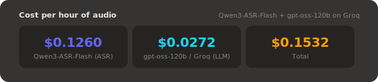

# vxbeamer

vxbeamer is a self-hosted, personal speech transcriber with a real-time web interface.

## Demo (how I use it)

I speak into my phone. The voice message is instantly transcribed. Then I can swipe on my phone to beam the transcription to my laptop.

[vxbeamer.webm](https://github.com/user-attachments/assets/ff6188ed-3d5c-4d0d-bbf1-a39916091e2a)

## Overview

For most of my transcription needs, I use [Google Gemini](https://ai.google.dev/gemini-api/docs/audio) (through the [@lsnr](https://dt.in.th/Lsnr) LINE bot) as it provides the highest accuracy. However, it comes with high latency, which makes it somewhat frustrating to use for voice typing scenarios. _(It has very high throughput though, e.g., 15 minutes of audio content can be transcribed in less than 20 seconds.)_

vxbeamer uses a different workflow: [Qwen3-ASR-Flash](https://modelstudio.console.alibabacloud.com/ap-southeast-1?tab=doc#/doc/?type=model&url=2840914_2&modelId=qwen3-asr-flash) handles real-time speech recognition, and [gpt-oss-120b](https://openai.com/index/introducing-gpt-oss/) (an open-source model by OpenAI, served on [Groq](https://groq.com) for fast inference) does post-processing. This trades some accuracy for significantly faster feedback.

The frontend is a PWA that can be added to the home screen. Tap the record button to transcribe, swipe right to broadcast a transcription as an event (for custom integrations), and swipe left to delete it.

This project is primarily for personal use and is not designed to be particularly flexible. That said, the setup is documented below.

## Usage


1. Deploy and configure the backend URL
2. Sign in with OIDC
3. To start transcribing, click the start recording button
4. To stop, click the same button
5. Click on the transcript bubble to copy, swipe left to delete, swipe right to beam to custom integrations

## Costs & Stats



## Architecture


- **Frontend** — React PWA (`apps/website`), deployed statically
- **Backend** — Node.js/Hono server (`apps/backend`), deployed via Docker
- **ASR** — Qwen3-ASR-Flash via DashScope (Alibaba Cloud)
- **Post-processing** — gpt-oss-120b via Groq

## Authentication

vxbeamer comes with 2 two authentication methods:

- **User authentication** via OIDC, for interactive use from the frontend.
- **API keys** (via `API_KEYS`), for integration with scripts.

### User authentication

The OIDC provider must support:

1. **PKCE flow** — the frontend performs the authorization code flow with PKCE and exchanges the resulting ID token for a session with the backend.
2. **Discovery document** — the provider must expose its configuration at the standard `/.well-known/openid-configuration` path.
3. **CORS** — cross-origin requests must be allowed, since the frontend will contact the provider directly from the browser.
4. **Restricted token issuance** — the provider must only issue ID tokens to authorized users. There is no built-in user whitelist in vxbeamer itself, so access control must be enforced at the provider level.

[Authentik](https://goauthentik.io) is a self-hosted, open-source identity provider that meets all of these requirements.

### API keys (personal access tokens)

Set the `API_KEYS` environment variable in the format `<sub>:key1,<sub>:key2`:

```
API_KEYS=your-sub-claim:my-secret-key,your-sub-claim:another-secret
```

To find your `sub` claim:

1. Sign in to the web app with OIDC
2. Open Settings (⚙️ icon)
3. Copy your `sub` from the "Signed in" section

The `<sub>` must match the `sub` claim of your OIDC user. You can have multiple keys for the same user (useful for key rotation or different integrations).

API keys are not used directly for authenticated requests. Instead, scripts exchange them for short-lived access tokens via `POST /auth/token`. This keeps all authentication consistent: protected endpoints only accept session tokens, regardless of whether they came from OIDC or API key exchange.

## Deployment

A full deployment consists of three parts:

1. **OIDC provider** — an OIDC-compatible identity provider such as Authentik (see [Authentication](#authentication) above).
2. **Backend** — a self-hosted server you run yourself (see below).
3. **Frontend** — the web application, available at [vxbeamer.vercel.app](https://vxbeamer.vercel.app). This hosted instance is provided as-is and connects to whichever backend URL you configure in its settings. Only the frontend is hosted; you must run your own backend.

### Backend

The backend is distributed as a Docker image.

```yaml
services:
  backend:
    image: ghcr.io/dtinth/vxbeamer:latest
    pull_policy: always
    restart: unless-stoppped
    expose:
      - 8787
    environment:
      - DASHSCOPE_API_KEY
      - GROQ_API_KEY
      - BYTEPLUS_API_KEY
      - OIDC_DISCOVERY_URL
      - OIDC_CLIENT_ID
      - OIDC_SECRET
      - API_KEYS
```

### Environment variables

| Variable             | Required | Description                                                  |
| -------------------- | -------- | ------------------------------------------------------------ |
| `DASHSCOPE_API_KEY`  | Yes      | Alibaba Cloud DashScope key for Qwen3-ASR-Flash              |
| `API_KEYS`           | No       | Comma-separated `sub:secret` pairs for API key exchange      |
| `GROQ_API_KEY`       | No       | Groq API key for gpt-oss-120b post-processing                |
| `OIDC_DISCOVERY_URL` | No       | OIDC provider discovery URL (alternative to API keys)        |
| `OIDC_CLIENT_ID`     | No       | OIDC client ID (default: `vxbeamer-mobile`)                  |
| `OIDC_AUDIENCE`      | No       | Expected token audience (default: same as client ID)         |
| `OIDC_SECRET`        | No       | HMAC secret for session tokens (default: `local-dev-secret`) |
| `WEBHOOK_URL`        | No       | Endpoint to POST completed transcriptions to                 |
| `PORT`               | No       | HTTP port (default: `8787`)                                  |

## API

The backend exposes a REST + SSE + WebSocket API on port 8787. All endpoints (except `/healthz` and `/auth/*`) require an access token, obtained by exchanging OIDC id_tokens or API keys.

### Endpoints

| Method      | Path                  | Description                                              |
| ----------- | --------------------- | -------------------------------------------------------- |
| `GET`       | `/healthz`            | Health check                                             |
| `GET`       | `/auth/config`        | OIDC configuration for the frontend                      |
| `POST`      | `/auth/session`       | Exchange an OIDC `id_token` for access & refresh tokens  |
| `POST`      | `/auth/token`         | Exchange an API key for an access token (no refresh)     |
| `POST`      | `/auth/refresh`       | Exchange a refresh token for new access & refresh tokens |
| `GET`       | `/sse`                | Server-Sent Events stream of all activity                |
| `GET`       | `/messages`           | List all messages (last 24 hours)                        |
| `GET`       | `/messages/:id`       | Get a single message                                     |
| `DELETE`    | `/messages/:id`       | Delete a message                                         |
| `POST`      | `/messages/:id/swipe` | Broadcast a swipe event for integrators                  |
| `WebSocket` | `/ws`                 | Stream PCM audio for transcription                       |

### SSE events

Connect to `/sse` to receive real-time events. Pass `?events=<type>` to filter, e.g. `?events=swiped` to receive only swipe events (the initial snapshot is skipped when a filter is active).

| Event type | Description                           |
| ---------- | ------------------------------------- |
| `snapshot` | Initial state — all current messages  |
| `created`  | A new recording session started       |
| `updated`  | Transcript updated (partial or final) |
| `deleted`  | A message was deleted                 |
| `swiped`   | A message was swiped right            |

### WebSocket protocol

Connect to `/ws?access_token=<token>`. Send raw PCM audio as binary frames (16 kHz, 16-bit signed, mono, little-endian). Send `{ "type": "stop" }` as a text frame to end the session gracefully.

### Authentication

All protected endpoints require an access token. Pass it as:

- `Authorization: Bearer <token>` header, or
- `?access_token=<token>` query parameter

#### Token flow

**For OIDC users (interactive frontend):**

1. Exchange OIDC id_token for access & refresh tokens: `POST /auth/session` with `id_token`
2. Access token (15 min TTL) is used for protected endpoints
3. When access token < 10 minutes remaining, refresh both tokens: `POST /auth/refresh` with `refresh_token`
4. Refresh token is valid for 3 days from the last refresh

**For API keys (scripts/integrations):**

1. Exchange API key for access token: `POST /auth/token` with `api_key`
2. Access token (15 min TTL) is used for protected endpoints
3. No refresh token is issued; obtain a new access token by exchanging the API key again
