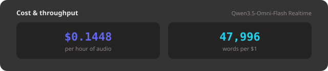

# vxbeamer

vxbeamer is a self-hosted, personal speech transcriber with a real-time web interface.

## Demo (how I use it)

I speak into my phone. The voice message is instantly transcribed. Then I can swipe on my phone to beam the transcription to my laptop.

[vxbeamer.webm](https://github.com/user-attachments/assets/ff6188ed-3d5c-4d0d-bbf1-a39916091e2a)

## Overview

For most of my transcription needs, I use [Google Gemini](https://ai.google.dev/gemini-api/docs/audio) (through the [@lsnr](https://dt.in.th/Lsnr) LINE bot) as it provides the highest accuracy. However, it comes with high latency, which makes it somewhat frustrating to use for voice typing scenarios. _(It has very high throughput though, e.g., 15 minutes of audio content can be transcribed in less than 20 seconds.)_

vxbeamer uses a different workflow: It uses [Qwen3.5 Omni](https://qwen.ai/blog?id=qwen3.5-omni) [Realtime](https://www.alibabacloud.com/help/en/model-studio/realtime) (via [Alibaba Cloud Model Studio](https://modelstudio.alibabacloud.com/)) to transcribe speech in real-time. This trades some accuracy for significantly faster feedback.

The frontend is a PWA that can be added to the home screen. Tap the record button to transcribe, swipe right to broadcast a transcription as an event (for custom integrations), and swipe left to delete it.

This project is primarily for personal use and is not designed to be particularly flexible. That said, the setup is documented below.

## Usage


1. Deploy and configure the backend URL
2. Sign in with OIDC
3. To start transcribing, click the start recording button
4. To stop, click the same button
5. Click on the transcript bubble to copy, swipe left to delete, swipe right to beam to custom integrations

## Costs & Stats



## Architecture


- **Frontend** — React PWA (`apps/website`), deployed statically (hosted on Vercel)
- **Backend** — Node.js/Hono server (`apps/backend`), deployed via Docker (self-hosted)
- **Desktop app** — Tauri desktop client (`apps/desktop`) that receives backend events and integrates with the local machine (basically, it’s the frontend web app with extra desktop integrations)
- **ASR** — Qwen Omni Realtime via DashScope (Alibaba Cloud)
- **Post-processing** — optional; gpt-oss-120b via Groq, for configurations whose output needs formatting cleanup (not needed for Qwen Omni Realtime, and not used by default)

## Authentication

vxbeamer comes with 2 two authentication methods:

- **User authentication** via OIDC, for interactive use from the frontend.
- **API keys** (via `API_KEYS`), for integration with scripts.

### User authentication

The OIDC provider must support:

1. **PKCE flow** — the frontend performs the authorization code flow with PKCE and exchanges the resulting ID token for a session with the backend.
2. **Discovery document** — the provider must expose its configuration at the standard `/.well-known/openid-configuration` path.
3. **CORS** — cross-origin requests must be allowed, since the frontend will contact the provider directly from the browser.
4. **Restricted token issuance** — the provider must only issue ID tokens to authorized users. There is no built-in user whitelist in vxbeamer itself, so access control must be enforced at the provider level.

[Authentik](https://goauthentik.io) is a self-hosted, open-source identity provider that meets all of these requirements.

### API keys (personal access tokens)

Set the `API_KEYS` environment variable in the format `<sub>:<key>`. In case of multiple keys, separate by commas:

```
API_KEYS=your-sub-claim:my-secret-key,your-sub-claim:another-secret
```

To find your `sub` claim:

1. Sign in to the web app with OIDC
2. Open Settings (⚙️ icon)
3. Copy your `sub` from the "Signed in" section

The `<sub>` must match the `sub` claim of your OIDC user. You can have multiple keys for the same user (useful for key rotation or different integrations).

API keys are not used directly for authenticated requests. Instead, scripts exchange them for short-lived access tokens via `POST /auth/token`. This keeps all authentication consistent: protected endpoints only accept session tokens, regardless of whether they came from OIDC or API key exchange.

## Deployment

A full deployment consists of three parts:

1. **OIDC provider** — an OIDC-compatible identity provider such as Authentik (see [Authentication](#authentication) above).
2. **Backend** — a self-hosted server you run yourself (see below).
3. **Frontend** — the web application, available at [vxbeamer.vercel.app](https://vxbeamer.vercel.app). This hosted instance is provided as-is and connects to whichever backend URL you configure in its settings. Only the frontend is hosted; you must run your own backend.

### Backend

The backend is distributed as a Docker image.

```yaml
services:
  backend:
    image: ghcr.io/dtinth/vxbeamer:latest
    pull_policy: always
    restart: unless-stoppped
    expose:
      - 8787
    environment:
      - DASHSCOPE_API_KEY
      - GROQ_API_KEY
      - BYTEPLUS_API_KEY
      - OPENAI_API_KEY
      - OPENROUTER_API_KEY
      - OIDC_DISCOVERY_URL
      - OIDC_CLIENT_ID
      - OIDC_SECRET
      - API_KEYS
```

### Environment variables

| Variable               | Required | Description                                                                                                    |
| ---------------------- | -------- | -------------------------------------------------------------------------------------------------------------- |
| `DASHSCOPE_API_KEY`    | Yes      | Alibaba Cloud DashScope key for Qwen3-ASR-Flash and Qwen Omni Realtime                                         |
| `API_KEYS`             | No       | Comma-separated `sub:secret` pairs for API key exchange                                                        |
| `GROQ_API_KEY`         | No       | Groq API key for gpt-oss-120b post-processing; enables the `+groq` configurations                              |
| `ASR_CONFIGURATION`    | No       | Default configuration id (default: derived from `ASR_PROVIDER`/`ASR_MODEL`/`GROQ_API_KEY`)                     |
| `ASR_CONFIGURATIONS`   | No       | Comma-separated configurations clients may select (default: every configuration with credentials)              |
| `ASR_PROVIDER`         | No       | Provider for the derived default: `qwen` (default), `qwen-omni`, `byteplus`, `openai`, `openrouter`, or `mock` |
| `ASR_MODEL`            | No       | Model for the derived default (default: the provider's own default model)                                      |
| `BYTEPLUS_API_KEY`     | No       | BytePlus key; enables the `byteplus` configurations                                                            |
| `BYTEPLUS_LANGUAGE`    | No       | BytePlus language hint, e.g. `th-TH` (default: unset — Mandarin/English only)                                  |
| `BYTEPLUS_RESOURCE_ID` | No       | BytePlus resource id (default: `volc.seedasr.sauc.duration`)                                                   |
| `BYTEPLUS_BASE_URL`    | No       | BytePlus endpoint base, without the mode path segment                                                          |
| `OPENAI_API_KEY`       | No       | OpenAI key; enables the `openai` (`gpt-live-transcribe`) configuration                                         |
| `OPENROUTER_API_KEY`   | No       | OpenRouter key; enables the `openrouter` (`microsoft/mai-transcribe-1.5`) configuration                        |
| `OIDC_DISCOVERY_URL`   | No       | OIDC provider discovery URL (alternative to API keys)                                                          |
| `OIDC_CLIENT_ID`       | No       | OIDC client ID (default: `vxbeamer-mobile`)                                                                    |
| `OIDC_AUDIENCE`        | No       | Expected token audience (default: same as client ID)                                                           |
| `OIDC_SECRET`          | No       | HMAC secret for session tokens (default: `local-dev-secret`)                                                   |
| `WEBHOOK_URL`          | No       | Endpoint to POST completed transcriptions to                                                                   |
| `PORT`                 | No       | HTTP port (default: `8787`)                                                                                    |

#### Eval storage

Where eval **votes** and **eval-sets** are saved. The backend only signs upload URLs; the browser uploads directly to the bucket, so recordings never pass through the server and no bucket credential ever reaches a browser. Setting `EVAL_STORAGE_BUCKET` turns the feature on; without it, evals still run and winners still apply, they are just not recorded.

| Variable                         | Required    | Description                                                           |
| -------------------------------- | ----------- | --------------------------------------------------------------------- |
| `EVAL_STORAGE_BUCKET`            | No          | S3-compatible bucket for votes and eval-sets. Enables eval storage    |
| `EVAL_STORAGE_ACCESS_KEY_ID`     | With bucket | Access key id used to sign upload URLs                                |
| `EVAL_STORAGE_SECRET_ACCESS_KEY` | With bucket | Secret access key used to sign upload URLs                            |
| `EVAL_STORAGE_REGION`            | No          | Bucket region (default: `us-east-1`)                                  |
| `EVAL_STORAGE_ENDPOINT`          | No          | Custom S3-compatible endpoint, e.g. MinIO or R2 (default: AWS)        |
| `EVAL_STORAGE_FORCE_PATH_STYLE`  | No          | Set to `true` for endpoints needing path-style addressing, e.g. MinIO |
| `EVAL_STORAGE_PREFIX`            | No          | Key prefix placed before `votes/` and `eval-sets/`                    |

Objects are keyed by kind, then UTC date, then time and message id:

```
votes/2026/07/16/2026-07-16T09-30-00-123Z-<messageId>.json
eval-sets/2026/07/16/2026-07-16T09-30-00-123Z-<messageId>.json
```

A **vote** (`{"type":"vote",…}`) is written on every winner pick and carries the winning configuration id, the full candidate list, per-candidate cost/latency/errors, and the audio's duration — but **no audio and no transcripts**, so it is safe to store unconditionally. An **eval-set** (`{"type":"eval-set",…}`) is written only when the user ticks save-for-eval, and adds the recording as a base64 WAV plus every candidate's transcript. A pick's vote and eval-set share a key suffix, so one finds the other.

## API

The backend exposes a REST + SSE + WebSocket API on port 8787. All endpoints (except `/healthz` and `/auth/*`) require an access token, obtained by exchanging OIDC id_tokens or API keys.

### Endpoints

| Method      | Path                   | Description                                              |
| ----------- | ---------------------- | -------------------------------------------------------- |
| `GET`       | `/healthz`             | Health check                                             |
| `GET`       | `/auth/config`         | OIDC configuration for the frontend                      |
| `POST`      | `/auth/session`        | Exchange an OIDC `id_token` for access & refresh tokens  |
| `POST`      | `/auth/token`          | Exchange an API key for an access token (no refresh)     |
| `POST`      | `/auth/refresh`        | Exchange a refresh token for new access & refresh tokens |
| `GET`       | `/sse`                 | Server-Sent Events stream of all activity                |
| `GET`       | `/asr/configurations`  | List the selectable model configurations                 |
| `GET`       | `/messages`            | List all messages (last 24 hours)                        |
| `GET`       | `/messages/:id`        | Get a single message                                     |
| `DELETE`    | `/messages/:id`        | Delete a message                                         |
| `POST`      | `/messages/:id/swipe`  | Broadcast a swipe event for integrators                  |
| `POST`      | `/messages/:id/winner` | Replace the primary answer with an eval winner's         |
| `WebSocket` | `/ws`                  | Stream PCM audio for transcription                       |

`POST /messages/:id/winner` takes `{ configurationId, transcript }` and replies with `{ ok: true, upload }`. When eval storage is configured, `upload` carries presigned PUT URLs for this pick's vote and eval-set; it is `null` otherwise. Signing is offline, so the URLs come back with the winner rather than costing a second round-trip — and because the winner is applied before they are minted, storage being unavailable can never fail the pick.

### SSE events

Connect to `/sse` to receive real-time events. Pass `?events=<type>` to filter, e.g. `?events=swiped` to receive only swipe events (the initial snapshot is skipped when a filter is active).

| Event type | Description                                                      |
| ---------- | ---------------------------------------------------------------- |
| `snapshot` | Initial state — all current messages                             |
| `created`  | A new recording session started                                  |
| `updated`  | Transcript updated (partial or final)                            |
| `deleted`  | A message was deleted                                            |
| `swiped`   | A message was swiped right (`eventId` is unique per swipe event) |

### WebSocket protocol

Connect to `/ws?access_token=<token>`. Send raw PCM audio as binary frames (16 kHz, 16-bit signed, mono, little-endian). Send `{ "type": "stop" }` as a text frame to end the session gracefully.

Optionally add `?configuration=<id>` to transcribe with a specific **model configuration** instead of the default one. Omit it and the session uses the configured default.

### Model configurations

A configuration is a provider, a model, and the post-processing chain applied to it. Post-processing is part of a configuration's identity rather than a request flag, so a model raw and the same model with Groq formatting are two separately selectable configurations that can be compared on equal terms:

| Configuration id                                   | Needs                               |
| -------------------------------------------------- | ----------------------------------- |
| `qwen/qwen3-asr-flash-realtime-2025-10-27`         | `DASHSCOPE_API_KEY`                 |
| `qwen/qwen3-asr-flash-realtime-2025-10-27+groq`    | `DASHSCOPE_API_KEY`, `GROQ_API_KEY` |
| `qwen/qwen3-asr-flash-realtime-2026-02-10`         | `DASHSCOPE_API_KEY`                 |
| `qwen/qwen3-asr-flash-realtime-2026-02-10+groq`    | `DASHSCOPE_API_KEY`, `GROQ_API_KEY` |
| `qwen-omni/qwen3.5-omni-flash-realtime-2026-03-15` | `DASHSCOPE_API_KEY`                 |
| `qwen-omni/qwen3.5-omni-plus-realtime-2026-03-15`  | `DASHSCOPE_API_KEY`                 |
| `qwen-omni/qwen3-omni-flash-realtime-2025-12-01`   | `DASHSCOPE_API_KEY`                 |
| `byteplus/bigmodel_nostream`                       | `BYTEPLUS_API_KEY`                  |
| `byteplus/bigmodel_nostream+groq`                  | `BYTEPLUS_API_KEY`, `GROQ_API_KEY`  |
| `openai/gpt-live-transcribe`                       | `OPENAI_API_KEY`                    |
| `openrouter/microsoft/mai-transcribe-1.5`          | `OPENROUTER_API_KEY`                |
| `mock/mock`                                        | nothing                             |

Every Qwen model id is a dated snapshot, not a floating one — the vendor repoints undated ids without notice, which would make a vote name a moving target. The Qwen Omni models need no `+groq` variant: their output is already well-formatted (Thai words in Thai, product names in Latin), which is what Groq formatting was tidying up for the plain ASR models — running it on top of Omni's output measurably added nothing.

BytePlus exposes two modes at two endpoints, and only `bigmodel_nostream` accepts a language — the bi-directional `bigmodel` mode covers Mandarin, English and a few Chinese dialects and nothing else, so on any other language it returns confident nonsense. Only `bigmodel_nostream` is offered as a configuration for that reason; the provider still serves `bigmodel` for deployments in those languages. Set `BYTEPLUS_LANGUAGE` (e.g. `th-TH`) or BytePlus falls back to that same Chinese/English default set. Note that `bigmodel_nostream` returns results only after 15 s of audio or the final packet, so it emits few or no partials — it is accuracy-tuned rather than low-latency.

OpenRouter is a batch HTTP endpoint fanning out to many backing vendors under one key, not a live socket like every other provider here — the whole clip is sent as one file once recording stops, so it produces no partial transcript. `microsoft/mai-transcribe-1.5` is the one model declared as a configuration, chosen after comparing 19 OpenRouter STT models on the same fixture `testdata/OBSERVATIONS.md` uses.

Ids contain `+`, which decodes to a space in a query string, so clients must URL-encode them — `URLSearchParams` does this automatically. The OpenRouter configuration id also contains `/` (the router's own model naming, e.g. `microsoft/mai-transcribe-1.5`), which needs no special handling in a query string value.

By default a configuration is selectable once the environment carries every credential it needs — which means `mock/mock`, needing none, is always selectable. Set `ASR_CONFIGURATIONS` to pin the list down explicitly. Requests naming an unknown, unconfigured, or disabled configuration are closed with code `1008` before any message is created.

#### Discovering them

`GET /asr/configurations` returns the selectable set, so a client does not have to hardcode the table above:

```json
{
  "primaryConfigurationId": "qwen-omni/qwen3.5-omni-flash-realtime-2026-03-15",
  "configurations": [
    {
      "id": "qwen-omni/qwen3.5-omni-flash-realtime-2026-03-15",
      "label": "Qwen3.5-Omni-Flash Realtime (2026-03-15, raw)",
      "providerId": "qwen-omni",
      "model": "qwen3.5-omni-flash-realtime-2026-03-15",
      "postProcessing": [],
      "configured": true
    }
  ]
}
```

Every listed `id` is one `/ws` accepts in `?configuration=`, which is what makes this list usable as a fan-out plan: an eval opens one socket per entry. `primaryConfigurationId` names the configuration the primary path uses; it is listed alongside the rest, since it competes on the same terms.

`configured` is almost always true — a configuration normally earns its place here by being credentialled. It is false only where an `ASR_CONFIGURATIONS` entry (or the default, which is always listed) was named without its credentials; such an entry is shown rather than hidden so the gap is visible, but connecting to it would close immediately. The response never carries credentials — not their values, and not the names of the missing variables either; the `/ws` close reason is where an operator reads which one to set.

### Authentication

All protected endpoints require an access token. Pass it as:

- `Authorization: Bearer <token>` header, or
- `?access_token=<token>` query parameter

#### Token flow

**For OIDC users (interactive frontend):**

1. Exchange OIDC id_token for access & refresh tokens: `POST /auth/session` with `id_token`
2. Access token (15 min TTL) is used for protected endpoints
3. When access token < 10 minutes remaining, refresh both tokens: `POST /auth/refresh` with `refresh_token`
4. Refresh token is valid for 3 days from the last refresh

**For API keys (scripts/integrations):**

1. Exchange API key for access token: `POST /auth/token` with `api_key`
2. Access token (15 min TTL) is used for protected endpoints
3. No refresh token is issued; obtain a new access token by exchanging the API key again
